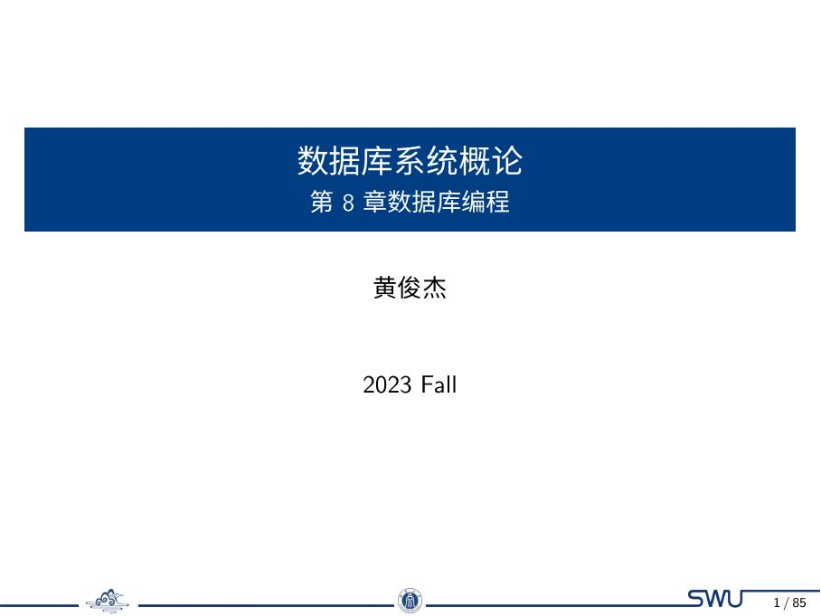
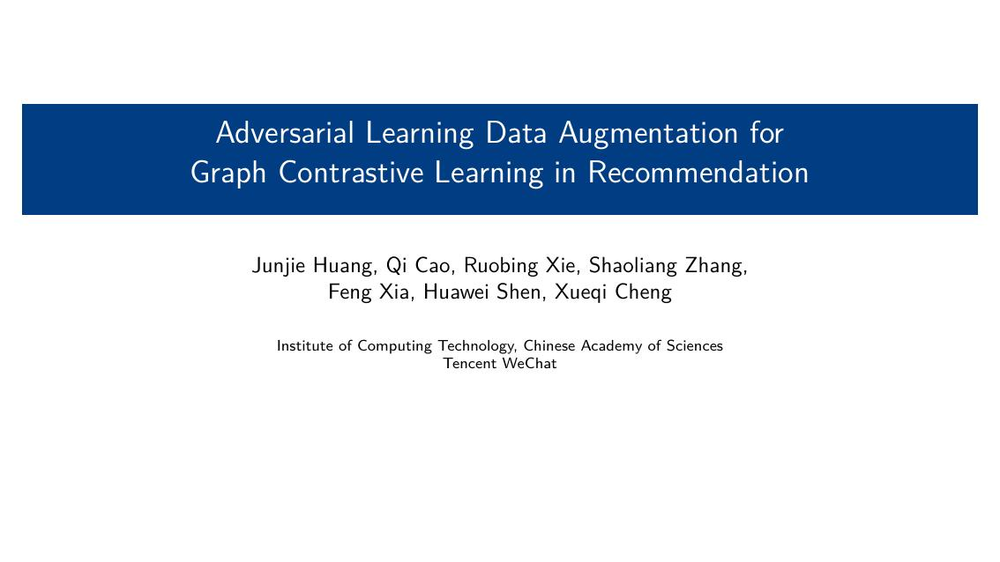

# simple-swu-beamer

`simple-swu-beamer` 是我设计和维护的西南大学风格 Beamer 主题，用于课程汇报、论文答辩与学术展示。

## 主题特性

- 基于 XeLaTeX 的中文友好方案（包含字体资源）
- 提供课程风格与论文汇报风格示例
- 支持 16:9 与 4:3 场景
- 提供 GitHub Pages 文档与一键下载示例包

## 预览

<table>
  <tr>
    <td align="center">
      
    </td>
    <td align="center">
      
    </td>
  </tr>
  <tr>
    <td align="center">
      
    </td>
    <td align="center">
      
    </td>
  </tr>
</table>

更新 README 预览图可执行：

```bash
./.venv/bin/python docs/pdf2imgs.py \
  --pdf-dir docs/_static/pdfs \
  --img-dir docs/readme-assets \
  --max-pages 1 \
  --dpi 180
```


## 快速开始

1. 进入示例模板目录并编译：

```bash
cd examples/_template
xelatex main.tex
```

2. 或直接运行本地完整检查：

```bash
./run_test.sh
```

## 文档与下载

- 在线文档：[GitHub Pages](https://huangjunjie-cs.github.io/simple-swu-beamer/)
- 示例页（含 PDF 预览）：[Examples](https://huangjunjie-cs.github.io/simple-swu-beamer/secs/examples.html)
- 一键下载示例包（含字体）：[examples.zip](https://huangjunjie-cs.github.io/simple-swu-beamer/_static/downloads/examples.zip)

## 目录结构

- `simple_swu_beamer/`：主题源码与字体、页脚素材
- `examples/`：示例工程与模板
- `docs/`：Sphinx 文档

## 声明

本项目为个人设计与维护项目，与西南大学官方部门无关。
