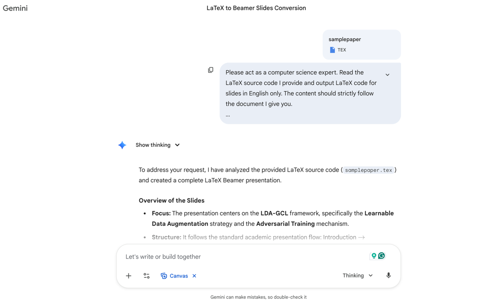

# Gemini 生成学术beamer



## 提示词

使用如下的提示词，经过一些时间，便可以得到一个比较工整的论文，自己需要修改的地方也不多。
主要是将那些图片占位符变成真正的图片即可。

```{attention}

1. 使用Gemini pro3, 打开Thinking
2. 使用canvas, 可以看到代码和生成结构
3. 尽量使用英文，中文有时候会有封控： I am LLM, I can not do that之类的。

```

My prompts:

```

Please act as a computer science expert. Read the LaTeX source code I provide and output LaTeX code for slides in English only. The content should strictly follow the document I give you.

I want you to focus on the final algorithm; do not expose too many low-level technical details. Keep the total number of slides within 30 pages. For the audience’s benefit, please insert \pause commands where appropriate. Avoid full sentences on the slides; only keep concise phrases.

You may add a small amount of background knowledge, such as the InfoNCE (which appears in the paper), but still only in the form of short phrases. Carefully read the abstract of the paper: I want the slides to cover the core contributions of the work. Basic concepts that are needed should be mentioned, but do not elaborate on them in detail. Also, generate a table of contents.

Please ensure that all technical points are correct. I want you to proactively double-check that every concept you use is accurate and actually comes from the paper.

You may use the figure/image paths from the original LaTeX. When you write the new LaTeX, you can insert the figure environments. To guarantee that the slides compile even without the actual images, insert a placeholder and then comment out the \includegraphics line.

Finally, note that in the canvas environment, special characters like & and % need to be properly escaped; otherwise the LaTeX will not compile correctly.

```

:::{dropdown} Gemini生成的tex

```{literalinclude} ../../examples/paper-ppt/ldagcl-gemini-default.tex
```
:::

:::{dropdown} 套用simple-swu-theme的tex（16:9）
```{literalinclude} ../../examples/paper-ppt/ldagcl-simpleswu.tex
```
:::

:::{dropdown} 套用simple-swu-theme的tex（4:3）
```{literalinclude} ../../examples/paper-ppt/ldagcl-simpleswu-43.tex
```
:::


::::{tab-set}

:::{tab-item} Gemini Default

```{raw} html
   <object
	data="../_static/pdfs/ldagcl-gemini-default.pdf"
	type="application/pdf"
	width="100%"
	height="450px"
	aria-labelledby="LDA-GCL"
   >
   	<p>
   		Your browser does not support PDFs.
   		<a href="../_static/pdfs/ldagcl-gemini-default.pdf">Download the PDF</a>
   	</p>
   </object>

```
:::

:::{tab-item} SimpleSWU (16:9)

```{raw} html
   <object
	data="../_static/pdfs/ldagcl-simpleswu.pdf"
	type="application/pdf"
	width="100%"
	height="450px"
	aria-labelledby="LDA-GCL"
   >
   	<p>
   		Your browser does not support PDFs.
   		<a href="../_static/pdfs/ldagcl-simpleswu.pdf">Download the PDF</a>
   	</p>
   </object>
```
:::

:::{tab-item} SimpleSWU (4:3)

```{raw} html
   <object
	data="../_static/pdfs/ldagcl-simpleswu-43.pdf"
	type="application/pdf"
	width="100%"
	height="450px"
	aria-labelledby="LDA-GCL"
   >
   	<p>
   		Your browser does not support PDFs.
   		<a href="../_static/pdfs/ldagcl-simpleswu-43.pdf">Download the PDF</a>
   	</p>
   </object>
```
:::

::::

改变的几个地方
1. 换主题
2. 添加QA 和 Reference
3. 修改代码


### 修改代码

```

% Slide 1: Title
\begin{frame}
    \titlepage
\end{frame}

====================== 

% Slide 1: Title
\titlepage

```


```
\begin{frame}
    \centering
    \Huge \textbf{Thank You!}
    
    \vspace{1cm}
    \Large Q \& A
\end{frame}

====================== 

\qapage

\refpage
```

## 其他

Gemini有时候会生成 16:9 有时候 会是 4:3。可以自己自行调节。

另外，可以进一步和它进行对话，要更多内容具体制定某个章节即可。

例如：

```
You need to add several frames that clearly explain the mathematical notation and symbols used in the paper, corresponding to the descriptions in Section 3.1.

```
